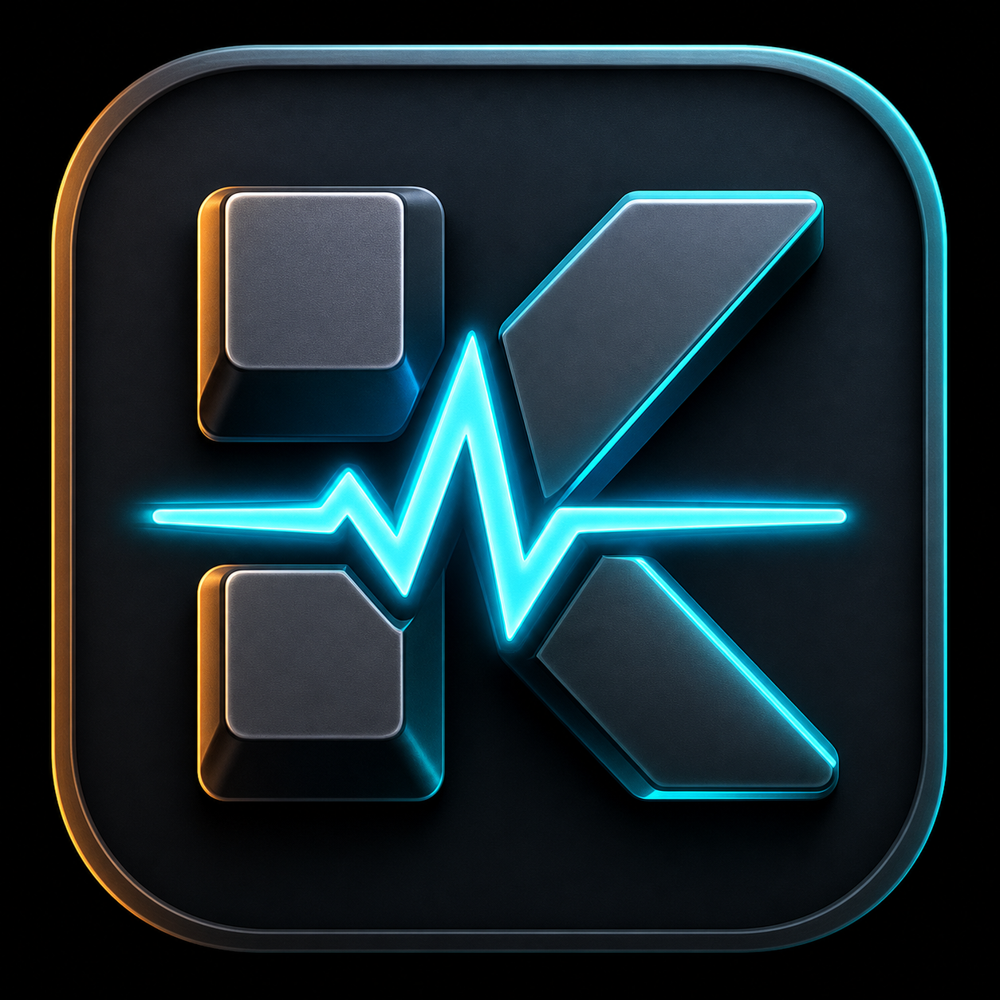

# KeyPulse



**KeyPulse** is a native Windows desktop analytics app for gamers who want to understand how they play.

It detects supported game processes, starts a local session when the game opens, counts keyboard and mouse inputs while that game is running, and saves long-term history in SQLite. No web dashboard, no SaaS account, no browser shell.

## What It Tracks

- A 6-second branded entrance on launch
- Game sessions from process start to process exit
- A separate live timer for the current session
- Total playtime per session and per game
- Total keyboard presses
- Per-key press counts such as `W`, `A`, `Space`, `Shift`, and `Tab`
- Mouse input counts for left click, right click, middle click, scroll up, and scroll down
- Lifetime totals across every tracked game
- Recent sessions, most played games, most used keys, and input heatmaps
- Optional real-time 80% gaming keyboard, mouse, and controller overlay for live pressed inputs

## What It Does Not Track

KeyPulse is designed around numerical input counters only.

It does **not** store:

- Typed text
- Passwords
- Chat messages
- Clipboard data
- Screenshots
- Game memory
- Network traffic

## Current Game Detection

KeyPulse intentionally tracks only explicit game executables:

- Built-in known game executables
- Custom executable mappings added through the local settings store

It does not automatically treat every process inside a game folder as a game. This keeps background apps, launchers, overlays, browsers, and chat clients out of your stats.

## Sessions

Each detected game launch creates a separate session row. The dashboard also shows lifetime totals, but session history is not merged into one fake session.

Example:

```text
Warframe session 1: 19:00 -> 20:15
Warframe session 2: 22:10 -> 23:00
```

Those remain two different sessions. Per-game totals are calculated from the session rows.

## Live Overlay

The dashboard has an **Overlay** toggle. When enabled, KeyPulse opens an always-on-top transparent overlay showing live keyboard, mouse, and controller presses. Drag the overlay with the mouse to place it anywhere on screen.

Current overlay support:

- Keyboard: 80% gaming layout with number row, QWERTY keys, modifiers, space, and arrows
- Mouse: left click, middle click, right click, scroll up, and scroll down counters
- Controller: XInput live overlay for Xbox controllers, shown only when a controller is detected
- PlayStation controllers: supported when Steam Input or DS4Windows exposes the controller as XInput

Controller buttons are labeled with Xbox and PlayStation-style names where possible, such as `A/Cross`, `B/Circle`, `X/Square`, `Y/Triangle`, `LB/L1`, `RB/R1`, `LT/L2`, and `RT/R2`.

Built-in examples include:

- Dofus
- League of Legends
- Valorant
- Counter-Strike 2
- Minecraft
- Grand Theft Auto V
- World of Warcraft
- Fortnite
- Elden Ring
- Apex Legends
- Overwatch
- Destiny 2

## Desktop App Stack

- Python
- PySide6 / Qt
- SQLite
- SQLAlchemy
- psutil
- pynput
- PyInstaller
- Inno Setup

## Run From Source

Use Python 3.11, 3.12, or 3.13 for the cleanest packaging experience.

```powershell
cd path\to\KeyPulse
py -m venv .venv
.\.venv\Scripts\python.exe -m ensurepip --upgrade
.\.venv\Scripts\python.exe -m pip install -r requirements.txt
.\.venv\Scripts\python.exe -m pip install -e . --ignore-requires-python
.\.venv\Scripts\pythonw.exe -m game_input_tracker
```

For debugging startup errors:

```powershell
.\.venv\Scripts\python.exe -m game_input_tracker
```

## Desktop Shortcut

This project includes a launcher:

```text
launch_keypulse.cmd
```

You can pin that file, or use the generated `KeyPulse` Desktop shortcut.

## Build The EXE

```powershell
cd path\to\KeyPulse
.\.venv\Scripts\pyinstaller.exe packaging\windows\keypulse.spec --clean --noconfirm
```

The packaged app is created at:

```text
dist\KeyPulse\KeyPulse.exe
```

You can share the whole `dist\KeyPulse` folder with a friend. They run:

```text
KeyPulse.exe
```

For a cleaner download, compress the folder:

```powershell
Compress-Archive -Path dist\KeyPulse -DestinationPath KeyPulse-portable.zip -Force
```

Then upload `KeyPulse-portable.zip` to GitHub Releases.

## Build The Installer

Install Inno Setup, then compile:

```powershell
iscc packaging\windows\KeyPulse.iss
```

The installer output is:

```text
packaging\windows\dist-installer\KeyPulseSetup.exe
```

For friends, the best production flow is:

1. Build `dist\KeyPulse\KeyPulse.exe` with PyInstaller.
2. Build `KeyPulseSetup.exe` with Inno Setup.
3. Create a GitHub Release.
4. Upload `KeyPulseSetup.exe`.
5. Your friends download and run the installer.

Unsigned Windows apps may show a SmartScreen warning. A production release should eventually be code-signed.

## Project Structure

```text
src/game_input_tracker/
  app.py                  Qt bootstrap, tray, timers, service wiring
  __main__.py             Python module entrypoint
  core/                   Process detection, input tracking, formatting, stats
  data/                   SQLAlchemy models, database setup, repository
  ui/                     PySide6 dashboard, charts, dark theme
docs/                     Architecture and SQLite schema notes
packaging/windows/        PyInstaller and Inno Setup configuration
tests/                    Focused unit tests
```

## Production Notes

Global keyboard and mouse hooks can be sensitive around anti-cheat systems. A production release should be code-signed, tested per game, and clearly disclose its privacy model. KeyPulse does not inject into games, read game memory, inspect packets, or draw overlays.

## Roadmap

- Settings screen for adding custom game executables
- Per-game opt-in and pause controls
- Export to CSV
- Month and weekday activity views
- Packaged signed installer
- Optional startup onboarding
