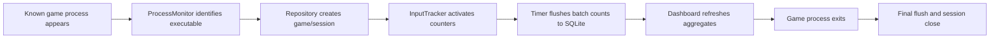

# KeyPulse Architecture

KeyPulse is a native Windows desktop application. It does not render a web application, run a local browser, or require a SaaS backend.

## Runtime Components

1. **PySide6 Application Shell**
   - Owns the `QApplication`, main window, tray icon, timers, and shutdown flow.
   - Closing the main window hides it to the system tray instead of quitting.

2. **Process Monitor**
   - Uses `psutil.process_iter()` on a Qt timer.
   - Tracks only known game executables or custom executable-to-game mappings stored in settings.
   - Ignores launchers, overlays, browsers, chat apps, and unrelated background processes.

3. **Input Tracker**
   - Uses `pynput` keyboard and mouse listeners.
   - Counts key presses, mouse clicks, and scroll events only while a game session is active.
   - Keeps only normalized counter names such as `W`, `Space`, `Left Click`, and `Scroll Down`.
   - Never records typed text, chat content, passwords, clipboard data, screenshots, or window contents.

4. **Persistence Layer**
   - Uses SQLAlchemy with SQLite.
   - Enables WAL mode, foreign keys, normal sync, and a busy timeout.
   - Writes input counts in batches every five seconds and again at session end.

5. **Statistics Layer**
   - Calculates lifetime totals, per-game summaries, top games, top keys, recent sessions, average inputs per hour, and average session duration.

6. **Native Dashboard**
   - Built entirely with PySide6 widgets.
   - Uses custom `QPainter` charts and heatmaps, avoiding browser engines and web dashboards.

## Session Flow



## Production Notes

Global input hooks can be sensitive around anti-cheat software. A production release should:

- Code-sign the executable and installer.
- Clearly disclose the privacy model during onboarding.
- Offer per-game opt-in/opt-out controls.
- Avoid injection, memory reading, overlays, or packet inspection.
- Test each target game because some anti-cheat systems restrict global hooks.
- Provide a panic pause/stop action from the tray menu.

## Extensibility

Custom game support is intentionally data-driven. A later settings screen can write mappings like:

```text
mygame.exe=My Game
anothergame-win64-shipping.exe=Another Game
```

The repository already reads this from the `custom_games` setting.
